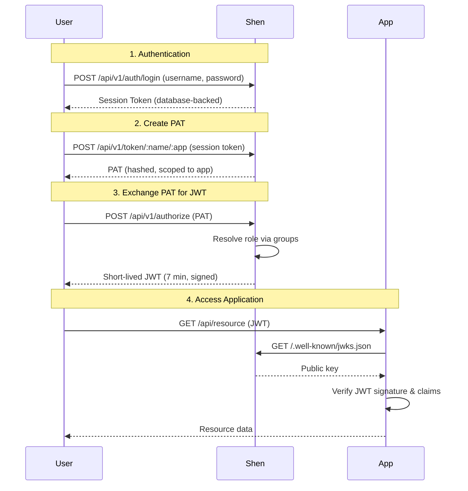

# Shen - Design Documentation

Shen is an authentication and authorization system for managing Personal Access Tokens (PATs) and Role-Based Access Control (RBAC) across applications.

## Overview

Shen provides:
- Session-based authentication for management operations
- Personal Access Tokens (PATs) scoped to specific applications
- Short-lived JWTs for application access
- Group-based permission management with RBAC
- Service accounts for automated systems
- CLI tool (`shenctl`) for administration

## Documentation Structure

1. **[Database Selection and Tooling](./docs/010-database.md)**
   - PostgreSQL, Docker, golang-migrate, sqlc

2. **[Authentication Flow](./docs/020-authentication.md)**
   - User login with username/password
   - Session token generation and management

3. **[Authorization Flow - Personal Access Tokens](./docs/030-authorization.md)**
   - Creating PATs scoped to applications
   - Exchanging PATs for short-lived JWTs
   - Role resolution via group memberships
   - Application JWT verification

4. **[Service Accounts](./docs/040-service-accounts.md)**
   - Service account characteristics
   - Token-only access workflow
   - Permission management via groups

5. **[Token Revocation](./docs/050-token-revocation.md)**
   - Token revocation API design
   - Authorization rules for revocation

6. **[Initial Bootstrap and Setup](./docs/060-bootstrap.md)**
   - Default admin account creation
   - RSA key pair generation for JWT signing
   - Database seeding (user roles, application roles)

7. **[Schema Design](./docs/070-schema.md)**
   - Complete database schema
   - All tables: users, groups, applications, tokens, sessions
   - Constraints and indexes

8. **[CLI Design](./docs/080-cli.md)**
   - `shenctl` command reference
   - User, group, application, and token management

9. **[RBAC Roles](./docs/090-rbac.md)**
   - Available application roles
   - Role priorities and resolution

10. **[Future Enhancements](./docs/100-future-enhancements.md)**
   - Token lifecycle notifications (expiration reminders, security alerts)
   - Audit logging
   - Key rotation
   - MFA, rate limiting, webhooks, OAuth 2.0

## Key Concepts

### Token Types

1. **Session Tokens** - For Shen management API access
   - 1 month expiration (configurable)
   - Database-backed for instant revocation
   - Required for all `shenctl` operations

2. **Personal Access Tokens (PATs)** - For application access
   - Scoped to user + application
   - 1 month expiration (configurable)
   - Exchanged for short-lived JWTs

3. **Short-lived JWTs** - For authenticated application requests
   - 7 minute expiration (configurable)
   - Signed with RSA keys
   - Contains user, role, and application scope

### Permission Model

- **Users** are assigned to **groups**
- **Groups** are assigned **roles** for specific **applications**
- When a user has multiple groups with different roles for the same app, the **highest priority** role wins
- **Service accounts** use the same permission model but cannot access Shen's management API

## Quick Start

1. Start Shen server (bootstraps admin account and keys)
2. Login with `shenctl`: `shenctl auth login`
3. Create an application: `shenctl app create my-app`
4. Create a group: `shenctl group create developers`
5. Assign role to group: `shenctl group assign-role developers my-app=viewer`
6. Add user to group: `shenctl user add-groups alice developers`
7. Create PAT: `shenctl token create alice-token my-app`
8. Use PAT to get JWT for application access

## Architecture Diagram

## Development Status

This is a learning project for understanding authentication and authorization system design. Current implementation status:

- ✅ Design complete
- ⏳ Implementation in progress
- ⏳ Testing
- ⏳ Documentation
- ⏳ Production hardening
